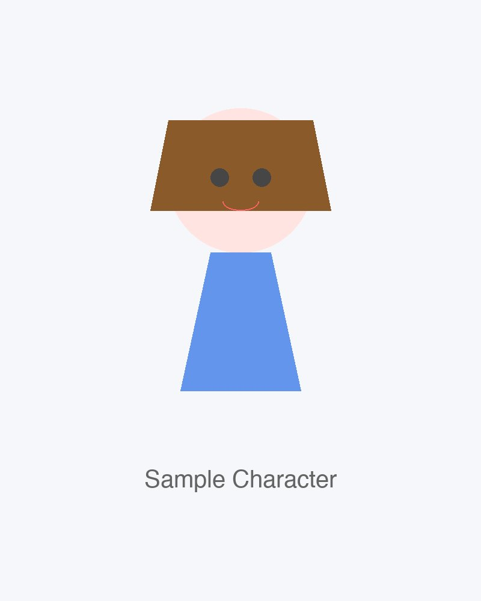

# 图片生成 Prompt 文档

主题：示例角色在阳光明媚的花园中阅读

角色/对象：示例角色

外站格式：通用外站

画幅：3:4

## 交付摘要

面向大多数外部图片生成平台的中文说明书格式。

复制主 Prompt，并把参考图作为附件上传；若平台支持负面词，再复制负面 Prompt。

## 推荐主 Prompt

```text
生成一张 3:4 的社交媒体日常打卡风格照片，现实化照片质感。
主题：示例角色在阳光明媚的花园中阅读
主体/角色：示例角色
人物优先原则：先锁定角色脸型轮廓、眉眼神态、表情习惯、肩颈姿态和互动节奏，再生成环境；目标是让角色如果真实存在就应该长成这样，转译成可信真人皮肤、鼻梁、嘴唇、发丝和摄影光线，不把角色改写成通用漂亮脸，也不把真实感压成普通路人感。角色身份、脸部气质、表情差异、群像可辨识性占主要权重。
年龄/骨相：东亚高中少女感，柔和圆润青春骨相；保存级社交照片质感，圆软脸、清透漂亮、可爱优先、非普通路人。不要成熟骨相、高颧骨、强下颌线、法令纹或成人化面部结构。
人物目标：温柔日常、人物关系自然、可爱优先
构图和镜头：优先保证人物脸部识别、表情差异和群像可辨识性的自然抓拍中景
动作要求：单张图只抓一个明确瞬间，用视线、距离、递物、自拍、整理头发、看手机、围桌或乐器动作表达关系；不要空洞站桩。
单图硬约束：只生成一张完整独立照片，只表现一个地点、一个时间点、一个完整瞬间；严禁拼贴画、多宫格、九宫格、分格排版、contact sheet、film strip 或把多张照片排列在同一画布里。
身体结构：每人只有两条手臂、两条腿，双手双脚关系清楚，关节连续自然。手指数量正确、手掌结构清楚，脚部轮廓完整。肢体不要和衣服、背景、道具或阴影融合。
光线：让脸部清楚、肤色自然、环境只作为托举人物的柔和现场光
环境服务原则：让环境只提供必要的关系线索、空间层次和生活痕迹；只保留能帮助人物成立的物件，不要让背景、道具或光效挤压脸部和人物互动。
色彩和曝光：新鲜绿色、玻璃漫射光和少量暖日光为主，画面明亮通透，人物肤色柔和。
参考图权重策略：identity_anchor 回答‘谁是谁’，context_support 只补场景关系，realized_translation 只转译真人质感。当前配比 identity=1, context=0, realized=0；如果角色相似度和现实化质感冲突，始终优先角色身份与可爱感。
参考图用途：sample_character_portrait（二次元/原作图优先锁定角色相似度）：示例角色肖像：用于演示参考图功能。。二次元/原作图优先回答‘谁是谁’，现实化样张只回答‘怎样转成可信真人照片’；不要复刻原图文字、logo、版式或截图质感。
整体风格：真实照片比例，清透轻修图，可爱优先于普通写实；角色符号可以清楚但材质必须真实，像角色本人进入现实生活，而不是廉价 cosplay 或普通 coser 照；克制、安静或沉默只通过表情和动作表达，不转换成全局冷灰低饱和、低曝光或疲惫滤镜。
避免：环境压过人物、拼贴画、多宫格、九宫格、contact sheet、动漫脸、蜡像皮肤、整齐站桩、可读乱码文字、水印、多人克隆同脸、僵硬列队站姿、所有人相同表情、多余手臂、多余腿、多余手指、缺手、缺脚、手脚和肢体融合、关节断裂、膝盖或脚踝消失、肢体和衣服、背景或道具融合在一起、手指数目不对、手指畸形、手掌扭曲。
```

## 负面 Prompt

```text
同一张脸换发色重复、脸部融合或角色混淆、主角不突出、边缘人物消失或糊成无脸、廉价假发感、多余手臂、多余腿、多余手指、缺手、缺脚、手脚和肢体融合、关节断裂、膝盖或脚踝消失、肢体和衣服、背景或道具融合在一起、手指数目不对、手指畸形、手掌扭曲、避免过度修图、美颜滤镜感、避免欧美成熟女性脸型、避免疲惫、憔悴、法令纹、避免廉价假发、漫展摆拍感、避免冷淡纪实风格、避免多人同脸、避免过度饱和或灰暗色调、不要把角色现实化成无辨识度的通用漂亮脸
```

## 完整规格 Prompt

```text
你正在生成一张现实化的乐队日常照片。

## 项目固定风格
社交媒体生活照 / 短视频截图式真实照片，保留角色识别点，但人物脸部必须是可信真实人像。

创作立场：

- 世界要精彩，像游乐园，也像五光十色的舞台。
- 画面设计的根本态度是喜爱和欣赏。
- 人物应保留内在光泽：发丝、姿态、眼神、服装色块、周围光线和空间节奏。

整体气质：

- 东亚少女感（16-19岁），可爱优先，其次真实、自然、漂亮。
- 人物面部骨相必须柔软圆润。
- 画面第一眼要有内容：画面冲击、故事性、温馨日常或平静陪伴至少成立一种。

视觉方向：

- 真实照片基础，允许清透修图、轻微柔焦和可爱梦幻感。
- 皮肤干净自然，不需要反复强调粗糙纪实纹理。
- 柔和但不虚假的光线。
- 颜色根据场景内容、构图和现场光线决定冷暖与饱和度。

角色现实化原则：

- 角色年龄默认锁定在16-19岁东亚少女范围。
- 二次元/原作图是身份根参考。
- 发色可以现实化去掉荧光感和塑料感，但角色辨识点、基本色相和局部色块要稳定。

## 角色设定
角色：示例角色

请保持该角色的核心识别度和性格气质。

## 本张图片
- 场景：示例角色在阳光明媚的花园中阅读
- 色彩/曝光：新鲜绿色、玻璃漫射光和少量暖日光为主，画面明亮通透，人物肤色柔和。

画面目标：第一眼要有画面冲击、故事性或温馨平静的日常感。主体清楚，表情自然，避免空洞摆拍。

## 避免事项
## 通用负面规则

- 避免过度修图、美颜滤镜感
- 避免欧美成熟女性脸型
- 避免疲惫、憔悴、法令纹
- 避免廉价假发、漫展摆拍感
- 避免冷淡纪实风格
- 避免多人同脸
- 避免过度饱和或灰暗色调

## 角色特定负面规则

- 不要把角色现实化成无辨识度的通用漂亮脸
- 不要用发色或外部物件替代人物本身的辨识
- 不要让场景道具挤掉角色识别
```

## 参考图（按优先级排序）

### 1. sample_character_portrait



- 工程路径：`assets/references/sample_character_portrait.jpg`
- 本机路径：`docs/public_release_assets/examples/minimal/assets/references/sample_character_portrait.jpg`
- 优先级：二次元/原作图优先锁定角色相似度
- 用途：示例角色肖像：用于演示参考图功能。
- 尺寸：800x1000

## 质检提示

- 没有命中素材库片段；可以补充主题关键词，或扩展 specs 中的素材。

## 使用提醒

- 参考图按排序使用：二次元/原作图是身份根参考，先锁定脸型轮廓、五官气质、眉眼神态、表情习惯、身形姿态和动作节奏；发型、服装、乐器与随身物件按场景辅助调整。
- 参考图用于稳定角色识别和群像关系，不要求复刻原图，也不要用乐器、包、衣服颜色替代人物本身的辨识。
- Markdown 版本适合在工程目录内用 Typora 预览，图片仍是文件链接。
- 同名 `_embedded.html` 是自包含版本，会把压缩后的参考图数据写入 HTML，适合单文件移动或分享。
- 实际提交给外部生图模型时，最稳妥的方式仍是复制 Prompt，并把参考图作为图片附件上传。
- 如果后续走文本生图，只使用 Prompt 文本；如果走图像输入或编辑流程，再读取上方参考图。
